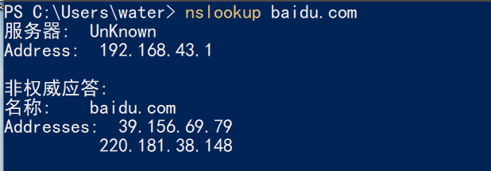
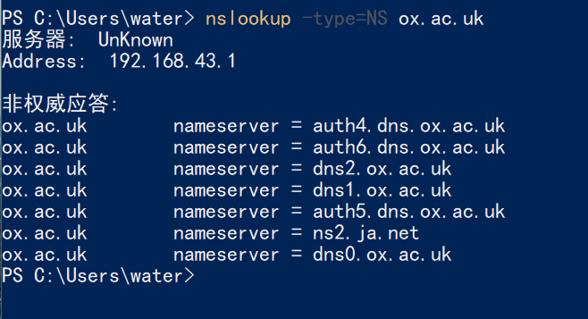
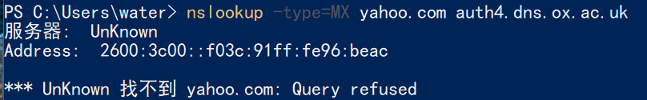
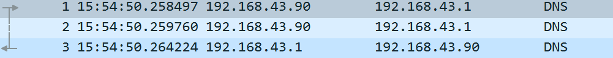
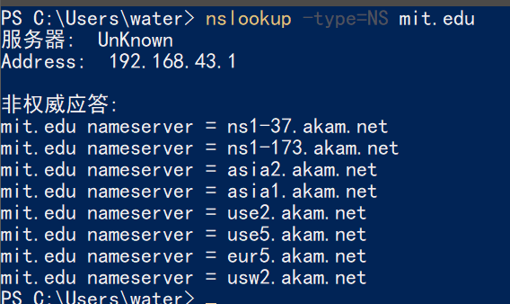
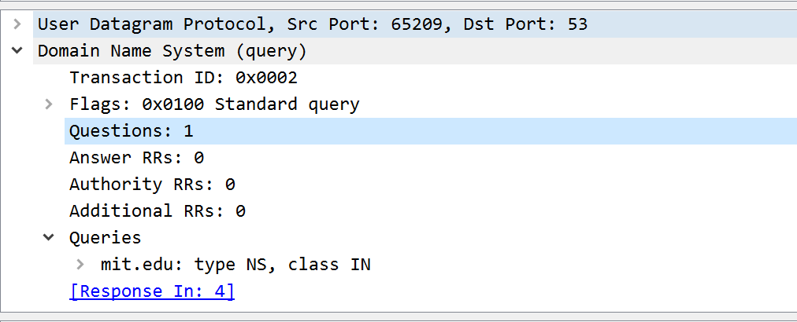
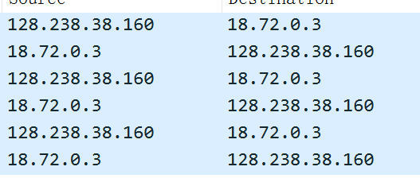

ps: 
1. 前面要连外网所以我的IP跑到美国那里去了，关了vpn发现要捕获的网络都改变了，无语，给我整蒙了好一会，学到了ipconfig(尤其是选项flushdns清除刷新dns缓存，displaydns列出dns，all全部)和nslookup两个指令
2. 有些地方还超时，吐了🤮，韩国网站，开了vpn也是，不过韩国好像也有墙，不知道是中国墙还是韩国墙的问题，还是网站本身的问题。
---
1.  

2.  

3. 失败了不知道为啥，理论上没问题啊。。正常nslookup -type=MX yahoo.com没问题

---
4. 通过UDP
5. 都是53
6. 是一样的

7. A(主机地址),不包含
8. 2，告诉的A类型主机Address的信息
9. 会有相对应的，因为我们正是通过DNS服务域名转IP来获得要访问的IP地址
10. 并没有(由于我不知道为啥打不开，用的是提供的文件)
---
11. 都是53
12. 192.168.43.1是(ipconfig可以看出来)
13. 无answer，tpye是A
14. 3个，就是返回的一些信息，两个cname别名，一个地址
15. 

---
16. 192.168.43.1(没指定dns服务器当然自然用本地dns服务器咯)，是
17. NS，不包含
18. 

不包含
19. 

---
20. 首先发向本地DNS服务器发，请求bitsy.mit.edu的dns服务器地址；然后发向bitsy.mit.edu这个dns服务器进行之后的查询(不过lab给的实例没体现，我的体现了这点，不过后面查那个韩国网站超时)

21. 类型是A，不包含
22. 返回了最终要查的主机的IP地址

23. 

