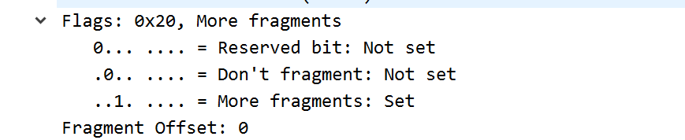
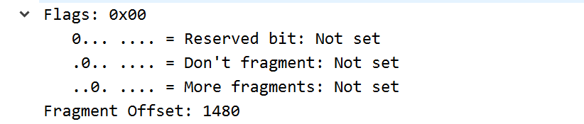

ps:
1. tracert指令就我的网关路由器还给我发ICMP，其他的路由器都不给我发，都是超时，🤮还是下个软件吧。

---
Answers:
1. 我的IP 192.168.43.90
2. Protocol: 1(ICMP)
3. header20B, 有效载荷36B, 用IP的total length减去header length
4. DF为0，说明可以分片(但不一定分片了)；MF为0，说明可能是未分片或者最后一片；检查Fragment Offset为0，说明是第一片不可能是最后一片，因该IP报文此未分片
---
5. Checksum, ttl, Identification(16位标识,不断+1来标识)
6. 保持不变：Sources, Destination, Protocol, Header Length, Version；必须保持不变：Sources, destination, Protocol, Version；必须更改的是：Header checksum, TTL, Identification
7. Identification随不断发送而增加(+1)
8. 0x2f19,50
9. Identification变了，因为IP标识是唯一的；ttl都是50
---
10. 分成两段，第一个分组是1480B加上20B的IP header正好是MTU
11. DF是0, MF是1, Offset是0 
12. DF是0, MF是0, Offset是1480，最后一片(MF为0) 
13. Total Length, Flags, Header checksum
---
14. 3个
15. Total Length, Flags, Header checksum
