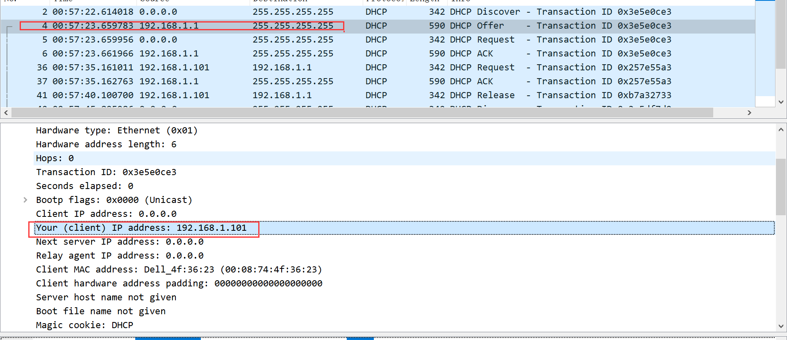
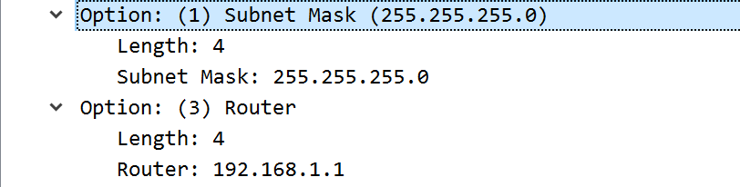
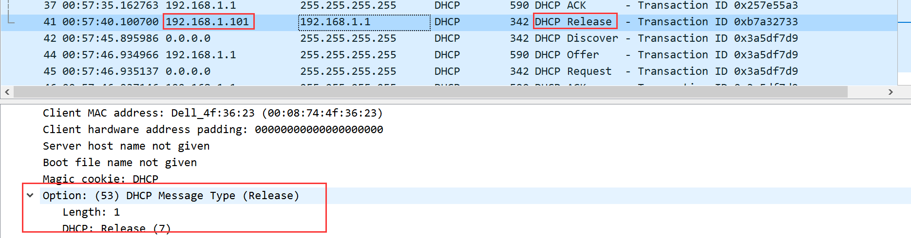

ps:
1. 由于太过麻烦，直接用了课程的抓包了。。

---
Answer:
1. 通过UDP
2. 1）0.0.0.0未绑定的dhcp客户通过目的255.255.255.255广播请求；2）dhcp服务器做出响应，里面有提供的ip；3）0.0.0.0广播自己的选择；4）dhcp响应确认。之后新的机器就有IP了。
3. MAC地址是00:08:74:4f:36:23
4. option不同
5. 0x3e5e0ce3，说明哪些是同一个主机的事务，避免给多个新来主机同时提供dhcp服务造成混乱
6.  0.0.0.0	    255.255.255.255
	192.168.1.1	255.255.255.255
	0.0.0.0	    255.255.255.255
	192.168.1.1	255.255.255.255
7. 192.168.1.1
8. 
9. 应该没有中继代理，dhcp的中继代理是用来跨网段分配ip的，通过dhcp服务器转发给另一个dhcp服务器，让它来处理，再把结果再转发回来(稍微了解下就行)
10. 路由器提供中继代理，子网掩码是区分网段 
11. server响应是Option: (54) DHCP Server Identifier (192.168.1.1)；client请求是Option: (50) Requested IP Address (192.168.1.101)
12. IP Address Lease Time: (86400s) 1 day
13. client告诉dhcp服务器取消租用ip 
14. 获取MAC地址放入缓存表 