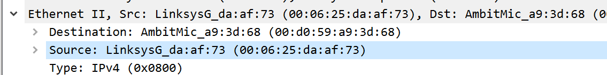
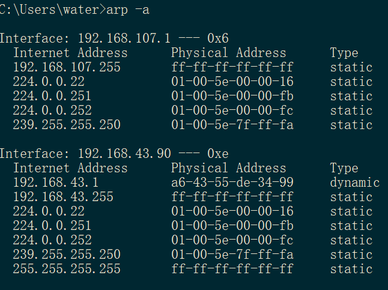

ps:
1. 了解了下ARP的作用，有网络层的都有路由转发表，通过路由表得到要往哪个IP去，同网段的(同一个以太网(局域网))通过ARP获取目标IP的MAC地址，再通过ARP表转发帧，不同网段的先去网关(通过路由去)，目的IP是网关，这一步也是通过ARP获取MAC地址，再通过ARP表转发帧。
2. 路由器之间转发，路由得到IP后，都是通过ARP获得MAC地址，再ARP表转发的。

---
Answers:
1. 00:d0:59:a9:3d:68
2. 00:06:25:da:af:73, 不是最终目的主机gaia的MAC地址, 是网关路由器的MAC地址
3. 0x0800, IPv4
4. 55Bytes
---
5. 00:06:25:da:af:73(以太网地址是MAC地址), 是网关路由器的地址 
6. 00:d0:59:a9:3d:68, 是我的电脑的MAC地址
7. 0x0800, IPv4
8. 68Bytes
---
9. 有广播地址，组播地址，路由地址(都是IP+MAC)，4个接口(一个无线网卡，一个有线网卡，vpn和虚拟机不知道什么原理也有接口) 
10. 00:d0:59:a9:3d:68 and ff:ff:ff:ff:ff:ff
11. 0x0800, IPv4
12. a) 20Bytes
    b) 1
    c) 包含
    d) 操作码可以看出(广播的方式也可以)
13. a) 20Bytes
    b) 2
    c) 操作码可以看出(目的地址是请求的源地址也可以)
14. from 00:06:25:da:af:73 to 00:d0:59:a9:3d:68
15. arp回复是单播的这台电脑当然收不到